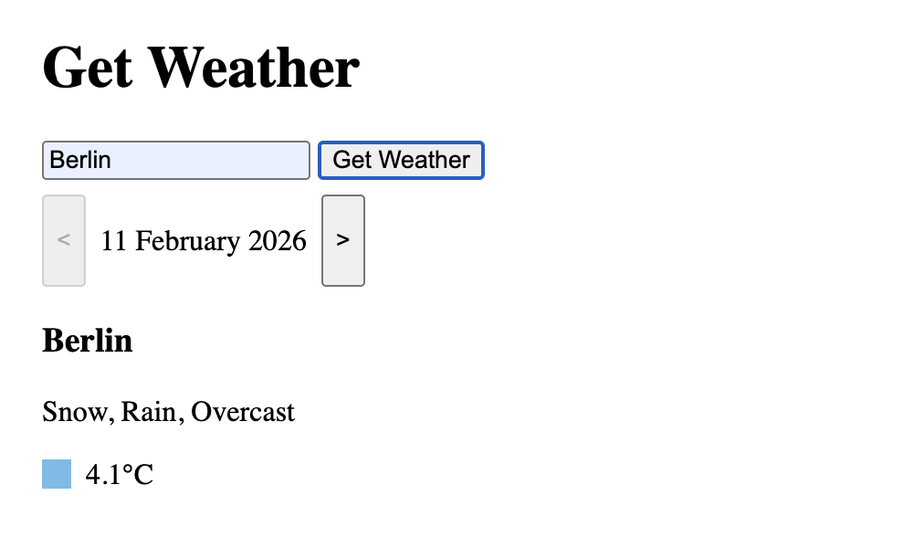

*This project is part of [The Odin Project](https://www.theodinproject.com/lessons/node-path-javascript-weather-app) Curriculum.*

# Weather App

*WORK IN PROGRESS*

## Description

Web app that uses [Virtual Crossing Weather API](https://www.visualcrossing.com/weather-api/) to fetch the weather forecast of a specific location.

The app uses a backend server that hides the API key and acts as proxy, forwarding the HTTP request from the frontend to the public API and returning the results.

At the current state, the backend does not modify any data.

## Live Demo

https://simone-gasparini-94.github.io/weather-app/

*Note: the server is hosted on the free version of [Render](https://render.com/), which means that requests can be delayed by 50 seconds or more when inactive.*